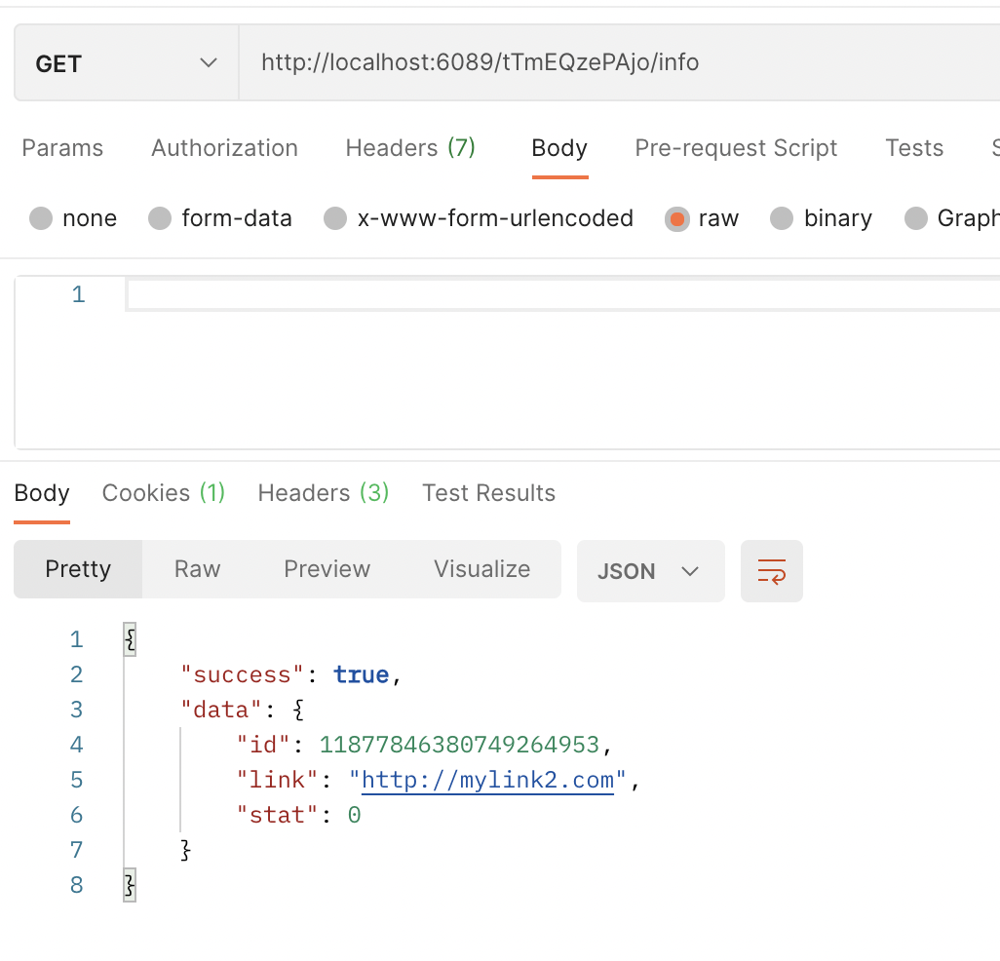

### Backend-разработка на Go. Уровень 1. Курсовая работа.
#### Описание:
Сокращатель ссылок. Переходя по короткой ссылке, пользователь отправляет запрос в
backend, который, ищет в хранилище длинную версию короткого URL, по которому был совершен переход. В случае нахождения в БД искомой
записи, сервер перенаправляет пользователя на соответствующий длинный URL и фиксирует в базе
факт перехода для того, чтобы в дальнейшем предоставить статистику владельцу URL’а.

#### ТЗ:
1) Программа должна генерировать уникальную короткую ссылку для введенного адреса.
   Сгенерированная ссылка должна содержать буквы английского алфавита (включая верхний регистр) и цифры.
   Пример: `http://test.ru/Qse23Sx`.
2) Программа должна перенаправлять на оригинальный URL при вводе короткой ссылки.
3) Программа должна предоставлять статистику по количеству переходов по короткой ссылке.

Требования к БД (redis):
1) Хранение информации, поля:
   короткая ссылка, оригинальная ссылка, количество переходов

2) Параметры подключения к БД должны быть в отдельном конфигурационном файле формата json или yaml.

- 19.05.2021 **Создал репозиторий и настроил линтеры, завел README.**
- 25.05.2021 **ТЗ, hasher.go.**
- 05.06.2021 **Добавлен пакет для чтения json конфигурационного файла.**  
             **Написаны тесты с пом-ю afero.**  
             **Для тестов - файловая система выделена в отдельный интерфейс.**  
- 10.06.2021 **Реализован интерфейс для redis.**  
             **Выбрал framework Gin, реализовал сокращение ссылки, получение информации по ней и редирект.**  
             **Добавил Makefile и zap логгер.**
  
- 11.06.2021 11.06.2021 **Обоснование выбора роутера: логического объяснения выбора - нет.  
  Для определения всех недостатков и преимуществ - необходимо больше опыта работы с разными фреймворками,  
  а сейчас, по-факту есть опыт только работы с Gin. Прочитать справку по работе других - явно недостаточно.  
  В Gin понравилась работа с middleware и контекстом**
